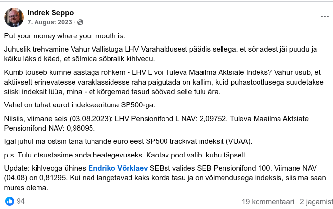

```{r}
library(dplyr)
library(tidyr)
library(forcats)
library(ggplot2)
library(stringr)
library(lubridate)
library(hrbrthemes)
library(xts)
library(quantmod)
library(rvest)
library(janitor)
library(ggfittext)

hrbrthemes::import_roboto_condensed()

# Läbipaistev taust, et graafikud blendiksid lehe taustaga
theme_transparent <- theme(
  plot.background = element_rect(fill = "transparent", colour = NA),
  panel.background = element_rect(fill = "transparent", colour = NA),
  legend.background = element_rect(fill = "transparent", colour = NA),
  legend.key = element_rect(fill = "transparent", colour = NA)
)

knitr::opts_chunk$set(dev.args = list(bg = "transparent"))
```

```{r}
# Kihlveo konstandid (defineeritud ühes kohas)
KIHLVEO_ALGUS <- ymd("2023-08-03")
KIHLVEO_LOPP  <- KIHLVEO_ALGUS + years(10)  # 2033-08-03
ANDMETE_LOPP  <- min(today(), KIHLVEO_LOPP)

# Fondide värvid (defineeritud ühes kohas)
FONDIDE_VARVID <- c("LHV Ettevõtlik" = "#4A4E5A", "SEB 18+" = "#60CD18",
                     "Tuleva Maailma Aktsiad" = "#00aeea")

url <- paste0("https://www.pensionikeskus.ee/statistika/ii-sammas/kogumispensioni-fondide-nav/?download=xls&date_from=",
              KIHLVEO_ALGUS, "&date_to=", ANDMETE_LOPP, "&f%5B0%5D=47&f%5B1%5D=80&f%5B2%5D=77")

navid <- tryCatch({
  raw <- read.delim(url, fileEncoding = "UTF-16", header = TRUE, dec = ",")
  if (nrow(raw) == 0) stop("Tühi vastus Pensionikeskusest")
  raw
}, error = function(e) {
  message("NAV andmete laadimine ebaõnnestus: ", e$message)
  data.frame(Fond = character(), Kuupäev = character(),
             NAV = numeric(), Lühinimi = character())
})

# Fondi nimede lühendamine
navid$Fond[navid$Fond == "Tuleva Maailma Aktsiate Pensionifond"] <- "Tuleva Maailma Aktsiad"
navid$Fond[navid$Fond == "SEB pensionifond 18+"] <- "SEB 18+"
navid$Fond[navid$Fond == "LHV Pensionifond Ettevõtlik"] <- "LHV Ettevõtlik"

# Kontrollime, kas kõik oodatud fondid on olemas
oodatud_fondid <- c("Tuleva Maailma Aktsiad", "SEB 18+", "LHV Ettevõtlik")
puuduvad <- setdiff(oodatud_fondid, unique(navid$Fond))
if (length(puuduvad) > 0) {
  warning("Puuduvad fondid pärast ümbernimetamist: ", paste(puuduvad, collapse = ", "),
          "\nOlemasolevad fondid: ", paste(unique(navid$Fond), collapse = ", "))
}
navid <- navid %>%
  mutate(Kuupäev = dmy(Kuupäev)) %>%
  group_by(Fond, Lühinimi) %>%
  arrange(Kuupäev, .by_group = TRUE) %>%
  mutate(NAV = if (first(NAV) != 0) NAV / first(NAV) else NA_real_) %>%
  ungroup()

navid_end <- navid %>%
  filter(Kuupäev == max(Kuupäev))

juhtimas <- navid_end %>%
  arrange(desc(NAV)) %>%
  slice(1)

max_kp <- max(navid$Kuupäev)

navid_end <- navid_end %>%
  mutate(Fond = fct_reorder(Fond, NAV)) %>%
  mutate(Fond = fct_rev(Fond))

navid <- navid %>%
  mutate(Fond = factor(Fond, levels = levels(navid_end$Fond)))

padding_date <- max_kp + days(60)

p <- navid %>%
  ggplot(aes(x = Kuupäev, y = NAV)) +
  geom_line(aes(color = Fond)) +
  geom_hline(yintercept = 1, linetype = "dashed", colour = "grey75") +
  geom_blank(aes(x = padding_date, y = 0.9)) +
  geom_point(data = navid_end, size = 2, aes(color = Fond)) +
  theme_ipsum_rc() +
  scale_color_manual(values = FONDIDE_VARVID) +
  scale_y_continuous(labels = scales::number_format(decimal.mark = ",")) +
  scale_x_date(date_labels = "%m/%Y") +
  geom_text(data = navid_end, aes(label = format(round(NAV,2), nsmall = 2, decimal.mark = ","), color = Fond), nudge_x = 45, show.legend = FALSE) +
  labs(title = "Kuidas läheb fondidel?", subtitle = paste0("Kui palju on väärt fondi ", format(KIHLVEO_ALGUS, "%d.%m.%Y"), "\nsissepandud euro nüüd?"),
       y = paste0(format(KIHLVEO_ALGUS, "%d.%m.%Y"), " sissepandud euro väärtus"), caption = paste0("allikas: Pensionikeskus\nseisuga: ", max_kp)) +
  theme_transparent
ggsave(p, file = "kihlvedu.png", height = 5, width = 7, scale = 1, bg = "transparent")

```


```{r}
# URL
url <- "https://www.pensionikeskus.ee/statistika/ii-sammas/kogumispensioni-paevastatistika/?is_async=1"

# Loeb sisse otse tabeli HTML-i (veakäsitlusega)
fondide_tasud <- tryCatch({
  leht <- read_html(url)

  tabel <- leht %>%
    html_element("table") %>%
    html_table() %>%
    clean_names()

  # Kontrollime, kas 'tasud' veerg eksisteerib
  if (!"tasud" %in% names(tabel)) {
    # Proovime leida sarnane veerg
    tasud_veerg <- grep("tasu", names(tabel), ignore.case = TRUE, value = TRUE)
    if (length(tasud_veerg) > 0) {
      names(tabel)[names(tabel) == tasud_veerg[1]] <- "tasud"
    } else {
      stop("Veergu 'tasud' ei leitud tabelis")
    }
  }

  tabel %>%
    mutate(
      jooksvad_tasud = as.numeric(str_replace(str_remove(tasud, "%"), ",", "."))
    ) %>%
    select(fond, jooksvad_tasud) %>%
    filter(
      str_detect(fond, "Tuleva Maailma Aktsiate Pensionifond|LHV Pensionifond Ettevõtlik|SEB pensionifond 18\\+")
    )
}, error = function(e) {
  message("Fondide tasude lugemine ebaõnnestus: ", e$message)
  data.frame(fond = character(), jooksvad_tasud = numeric())
})

# Muudame fondi nimed lühemaks
fondide_tasud <- fondide_tasud %>%
  mutate(fond = case_when(
    fond == "Tuleva Maailma Aktsiate Pensionifond" ~ "Tuleva Maailma Aktsiad",
    fond == "LHV Pensionifond Ettevõtlik" ~ "LHV Ettevõtlik",
    fond == "SEB pensionifond 18+" ~ "SEB 18+",
    TRUE ~ fond
  ))

# Visualiseerime, kui palju maksad iga 10 tuhande euro kohta jooksvaid tasusid aastas

fondide_tasud <- fondide_tasud %>%
  mutate(jooksvad_tasud_10k = jooksvad_tasud * 100)  # % * 10000€

if (nrow(fondide_tasud) > 0) {
  p_tasud <- fondide_tasud %>%
    ggplot(aes(x = fct_reorder(fond, jooksvad_tasud_10k), y = jooksvad_tasud_10k)) +
    geom_col(aes(fill = fond), show.legend = FALSE) +
    scale_fill_manual(values = FONDIDE_VARVID) +
    geom_bar_text(aes(label = paste0(round(jooksvad_tasud_10k, 2), "€")), vjust = -0.5) +
    scale_y_continuous(labels = scales::comma_format(decimal.mark = ",")) +
    labs(title = "Fondide jooksva tasu suurus", subtitle = "Kui palju maksad jooksvaid tasusid aastas\niga senikogutud 10 tuhande euro kohta?",
         x = "fond", y = "jooksvad tasud (eurot aastas)", caption = "allikas: Pensionikeskus") +
    coord_flip() +
    theme_ipsum_rc() +
    theme_transparent
} else {
  p_tasud <- ggplot() +
    annotate("text", x = 0.5, y = 0.5,
             label = "Fondide tasude andmed pole kättesaadavad") +
    theme_void()
}
```


```{r include=FALSE}
# Yahoo Finance'i andmete allalaadimine (kasutame tsentraalseid konstante)
sp500_ok <- tryCatch({
  sp500_raw <- getSymbols("^SP500TR", src = "yahoo", from = KIHLVEO_ALGUS, to = ANDMETE_LOPP, auto.assign = FALSE)
  TRUE
}, error = function(e) {
  message("S&P 500 TR andmete allalaadimine ebaõnnestus: ", e$message)
  FALSE
})

eur_usd_ok <- tryCatch({
  eur_usd_raw <- getSymbols("EURUSD=X", src = "yahoo", from = KIHLVEO_ALGUS, to = ANDMETE_LOPP, auto.assign = FALSE)
  TRUE
}, error = function(e) {
  message("EUR/USD andmete allalaadimine ebaõnnestus: ", e$message)
  FALSE
})

yahoo_ok <- sp500_ok && eur_usd_ok
if (yahoo_ok) {
  sp500_tr <- Cl(sp500_raw)
  eur_usd <- Cl(eur_usd_raw)
}
```


```{r}
if (yahoo_ok) {
  # Kaitseme nulliga jagamise ja Inf/NA eest
  eur_usd_clean <- eur_usd
  eur_usd_clean[eur_usd_clean == 0] <- NA

  # Teisendame S&P 500 Total Return EUR-idesse
  sp500_tr_eur <- sp500_tr / eur_usd_clean
  sp500_tr_eur <- na.approx(sp500_tr_eur, na.rm = FALSE)
  sp500_tr_eur <- na.omit(sp500_tr_eur)

  sp500_tr_eur_df <- data.frame(
    Date = index(sp500_tr_eur),
    SP500TR.Close = coredata(sp500_tr_eur)
  )

  # Kaitseme esimese väärtusega jagamise eest
  if (nrow(sp500_tr_eur_df) > 0 && sp500_tr_eur_df$SP500TR.Close[1] != 0) {
    sp500_tr_eur_df <- sp500_tr_eur_df %>%
      mutate(SP500TR.Close = SP500TR.Close / SP500TR.Close[1] * 1000)
  }

  sp500_lastvalue <- sp500_tr_eur_df %>%
    filter(Date == max(Date))

  max_date <- max(sp500_lastvalue$Date)
  p_summa <- sp500_tr_eur_df %>%
    ggplot(aes(x = Date, y = SP500TR.Close)) +
    geom_line() +
    geom_point(data = sp500_lastvalue, size = 2) +
    geom_text(data = sp500_lastvalue, aes(label = paste0(round(SP500TR.Close), "€")), nudge_x = 45) +
    scale_x_date(date_labels = "%m/%Y") +
    theme_ipsum_rc() +
    labs(title = "Kui suur summa on mängus?", x = "kuupäev", y = "kihlveo summa", caption = paste0("allikas: Yahoo Finance\nseisuga ", max_date)) +
    theme_transparent
} else {
  # Loome tühja graafiku, kui Yahoo andmed pole kättesaadavad
  sp500_lastvalue <- data.frame(Date = ANDMETE_LOPP, SP500TR.Close = 1000)
  max_date <- ANDMETE_LOPP
  p_summa <- ggplot() +
    annotate("text", x = 0.5, y = 0.5, label = "Yahoo Finance andmed pole kättesaadavad") +
    theme_void()
}
```


::: {.hero-banner}
## Pensionifondide kihlvedu

::: {.lead}
Tuleva vs LHV vs SEB - kümneaastane võitlus parima tootluse eest
:::

*Andmed/graafikud uuenevad automaagiliselt iga päev lõuna paiku*
:::

::: {.stats-grid}
::: {.stat-card}
<span class="stat-number">**`r as.numeric(Sys.Date() - KIHLVEO_ALGUS)`**</span>
<span class="stat-label">päeva möödunud</span>
:::
::: {.stat-card}
<span class="stat-number">**`r round(pmax(0, 10 - (as.numeric(Sys.Date() - KIHLVEO_ALGUS) / 365.25)), 1)`**</span>
<span class="stat-label">aastat jäänud</span>
:::
::: {.stat-card}
<span class="stat-number">**`r juhtimas$Fond`**</span>
<span class="stat-label"> -- hetkel juhtimas</span>
:::
::: {.stat-card}
<span class="stat-number">**€`r round(sp500_lastvalue$SP500TR.Close)`**</span>
<span class="stat-label"> -- panuse suurus (muutub ühes SP500ga)</span>
:::
:::

<hr class="section-divider">

# Taustast

Juhuslik trehvamine Vahur Vallistuga LHV Varahaldusest päädis sellega, et sõnadest jäi puudu ja käiku läksid käed, et sõlmida sõbralik kihlvedu.

Kumb tõuseb kümne aastaga rohkem - **LHV Ettevõtlik** (tol ajal LHV L) või **Tuleva Maailma Aktsiate Indeks**? Vahur usub, et aktiivselt erinevatesse varaklassidesse raha paigutada on kallim, kuid puhastootlusega suudetakse siiski indeksit lüüa, mina - et kõrgemad tasud söövad selle tulu ära.

Päev hiljem liitus kihlveoga Endriko Võrklaev SEBst fondiga, mille nimeks tänaseks **SEB pensionifond 18+**.

Vahel on **tuhat eurot indekseerituna S&P500-ga** (S&P 500 on USA 500 suurima börsiettevõtte aktsiate indeks, üks maailma tuntuimaid turuindekseid).

Loe, kust kõik alguse sai:

::: {.grid .my-4}

::: {.g-col-12 .g-col-md-6}
::: {.card .source-card .position-relative}
<div class="card-badge">Facebook</div>
::: {.card-header .text-center}
### [Originaalkihlvedu](https://www.facebook.com/indrek.seppo/posts/pfbid0iQX5FvSVkaguvpt6bnhMvec4iyXEZGdDK3ZuLe1mHqaBKHAJVW8BmUg2usAxhH3Sl)
:::
::: {.card-body}
[](https://www.facebook.com/indrek.seppo/posts/pfbid0iQX5FvSVkaguvpt6bnhMvec4iyXEZGdDK3ZuLe1mHqaBKHAJVW8BmUg2usAxhH3Sl)
:::
:::
:::

::: {.g-col-12 .g-col-md-6}
::: {.card .source-card .position-relative}
<div class="card-badge">Ekspress</div>
::: {.card-header .text-center}
### [Meediakajastus](https://ekspress.delfi.ee/artikkel/120227188/eksperdid-vaidlevad-pensionide-teemal-lhv-suurima-vaenlase-ja-pankuri-debatis-jai-sonadest-vaheks-kaiku-laksid-kaed)
:::
::: {.card-body}
[](https://ekspress.delfi.ee/artikkel/120227188/eksperdid-vaidlevad-pensionide-teemal-lhv-suurima-vaenlase-ja-pankuri-debatis-jai-sonadest-vaheks-kaiku-laksid-kaed)
:::
:::
:::

:::


<hr class="section-divider">

# Tootluse võrdlus

Kihlvedu on teadlikult tehtud pika aja peale. Lühiajalist statistikat mõjutab liigselt juhus. Aga meelelahutuslikel eesmärkidel võib seda ikka jälgida.


{fig-alt="Graafik pensionifondide tootlusest"}

# Millised on fondide jooksvad tasud?

Jooksvad tasud sisaldavad kõiki tasusid, mis fondi kogumisse minevast rahast maha arvatakse (nii fondi juhtimisega seotud tasud, kui näiteks ostu-müügitehingute hinnad jne). Oluline on siin ka see, et neid tasusid **maksad igal aastal kogu senikogutu pealt**, mitte üksnes lisanduva summa pealt. Ehk kui fondi kogum on 10 000 eurot, siis 1% tasu tähendab, et maksad 100 eurot aastas. Kui see kogum kasvab 20 000 euro peale, siis maksad juba 200 eurot aastas ja nii iga aasta.

```{r}
#| fig-width: 7
#| fig-height: 4

p_tasud
```
NB! Jooksvad tasud on ajas muutuvad, siin on näidatud nende viimane seis, mis avaldatud Pensionikeskuses. Tuleva ühistu liikmena saaksid veel 5€ tagasi *kickback*i oma liikmekapitali arvele.

Aktiivselt juhitud fondid peavad indeksfondidega sammu pidamiseks ületama turukeskmist (ehk turuindeksit) rohkem, kui nende jooksvad tasud ületavad indeksfondi tasusid. Kogu minu argument on, et ajalooliselt ei ole nad keskmiselt seda suutnud. Kas võib olla erandeid? Võib, aga ma ei paneks oma raha selle alla. Vahur ja Endriko usuvad endasse rohkem.


# Kuidas on läinud summal, mille peale kihla vedasime?

Me vedasime kihla 1000€ peale indekseerituna S&P 500-sse. Kuis see summa aja jooksul kasvanud/kahanenud on ja kuhu tänaseks jõudnud?

```{r}
p_summa
```


# Kuidas on LHV fondidel läinud pikemas perspektiivis võrreldes Tulevaga?

Tegelikult ei ole pensioniinvestori jaoks kuigi oluline see, kui palju tõuseb mõni fond kahe kuupäeva vahel. Meid huvitab, palju meie jooksvad sissemaksed tõusevad selleks ajaks, kui neid välja võtma hakkame. Ehk neid kuupäevi, mille vaheline kasv -- või langus -- meid huvitab, on palju.

Ma olen siin graafikul püüdnud seda visualiseerida. Ta ei ole päris täpne -- ma olen siin eeldanud, et igal päeval on veidi raha pensionifondi kantud (tegelikult kantakse kuskil kuu keskel) ja arvutanud, kui palju see keskmiselt viimastel andmetel kasvanud on.

Kuna seda inspireeris mind tegema mingi LHV fondide reklaam, siis võrdlen siin neid fonde, mida LHV hoogsalt soovitab, Tuleva indeksiga, kus ma ise olen. Võrdluseks on lisatud inflatsioon.

{fig-alt="Aastane tootluse võrdlus LHV ja Tuleva vahel"}

Huvitav on seegi, kuidas see graafik üle aja muutunud on. Kliki videol, et näha, kuidas see graafik ajas muutunud on.

<video width="100%" preload="metadata" muted playsinline controls poster="aastane_tulu_tuleva_lhv.png">
  <source src="aastane_tulu_animeeritud.mp4" type="video/mp4">
</video>


# Kust näha, kuidas on läinud sinul endal?

::: {.grid .my-4}

::: {.g-col-12 .g-col-md-6}
::: {.card .source-card}
::: {.card-header .text-center}
### [Pensionikeskus](https://www.pensionikeskus.ee)
:::
::: {.card-body .p-3}
**Ametlik II samba portaal**

- Logi sisse Pensionikeskuse lehele
- Mine: **Raportid → Tootlus**
- Vaata oma raha tootlust

[Ava Pensionikeskus →](https://www.pensionikeskus.ee){.btn .btn-primary .btn-sm .mt-2}
:::
:::
:::

::: {.g-col-12 .g-col-md-6}
::: {.card .source-card}
::: {.card-header .text-center}
### [Tuleva portaal](https://pension.tuleva.ee/)
:::
::: {.card-body .p-3}
**Detailne analüüs**

- Ei pea olema Tuleva koguja
- Võrdlus inflatsiooniga
- Näed täpseid jooksvaid tasusid

[Ava Tuleva portaal →](https://pension.tuleva.ee/){.btn .btn-success .btn-sm .mt-2}
:::
:::
:::

:::
